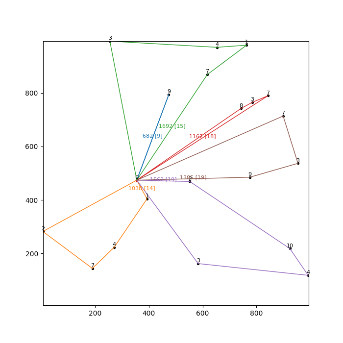

# Applied Reinforcement Learning methods for the Capacitated Vehicle Routing Problem

This project reviews reinforcement learning (RL) approaches to optimization problems in general, then dive deeper for the Capacitated Vehicle Routing Problem (CVRP). The problem is formulated as a RL problem, then several RL methods are implemented as an endeavor to solve it, in comparison with the solutions provided by OR-Tools, namely:
- Deep Q-Network (DQN)
- Advantage Actor-Critic (A2C)
- Proximal Policy Optimization (PPO)


## Run
- Install all of the requirements using Anaconda
```bash
conda env create --name cvrp_rl_env -f environment.yml
conda activate cvrp_rl_env
```

- Train, test, and visualize all models once
```bash
python delivery.py
```

- Train and test all models
```bash
python test_algos.py
```
